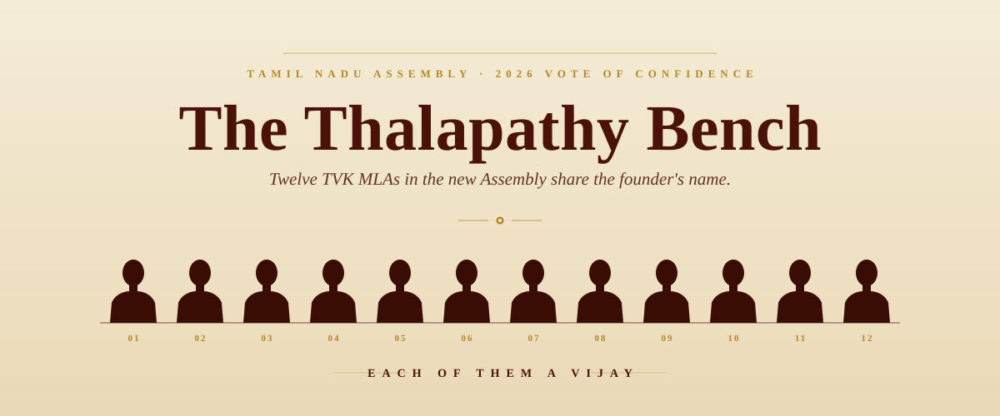

# The Thalapathy Bench

*Twelve TVK MLAs share the founder's name. A short note from the floor of the 2026 vote of confidence.*

I grew up in Thiruvarur in the years when Rajinikanth ruled the box office. Two of the most popular young men in the neighbourhood went by Rajini Sakthi and Rajini Chinna. Neither was born with that name. Both ran small Rajini *rasigar mandram* (fan club) units, and the Rajini prefix was how the rest of us knew them. They were not unusual. Almost every Tamil town had its Rajini-something or Kamal-something or, later, Ajith-this and Vijay-that running fan clubs that erected hoardings the size of buildings in front of the local theatre, poured milk and draped flower garlands over giant cut-outs on release day, and blasted firecrackers down the main road through the small hours of the morning.

I was reminded of all of that this week, watching the Tamil Nadu Assembly's vote of confidence. Beyond the founder C. Joseph Vijay himself, the Speaker kept calling out the same first name from his benches. Vijaykumar. Vijayprabhu. Vijay Balaji. Vijayaraj. Vijaysaravanan. After the fifth or sixth one, it stopped feeling like coincidence. The fan club captains, it turns out, had walked all the way into the legislature, and they had brought their adopted prefix with them.

So I went and counted.

## The headline number

Of the 108 MLAs that Tamilaga Vettri Kazhagam (TVK) sent into the new Assembly, **12 carry "Vijay" somewhere in their name**. That is one in every nine TVK legislators. Put differently, every time the Speaker reads through nine TVK members, on average one of them is some flavour of Vijay.

For context, the next-largest contingent in the House is the AIADMK with 47 MLAs, and only two of them carry the name. The DMK, despite holding 59 seats, sent zero MLAs named Vijay to the floor. The Vijay concentration is, statistically, a TVK phenomenon.

## The list

Here is the roll, in constituency order:

| AC | Constituency | MLA | Vote share |
|---:|---|---|---:|
| 1 | Gummidipoondi | S. Vijayakumar | 40.6% |
| 9 | Madavaram | M.L. Vijayprabhu | 52.6% |
| 12 | Perambur | C. Joseph Vijay | 58.9% |
| 17 | Royapuram | K.V. Vijay Damu | 46.4% |
| 33 | Thiruporur | B. Vijayaraj | 42.0% |
| 90 | Salem (South) | Vijay Tamilan Parthiban A. | 44.0% |
| 97 | Kumarapalayam | C. Vijayalakshmi | 39.5% |
| 98 | Erode (East) | M. Vijay Balaji | 42.9% |
| 141 | Tiruchirappalli (East) | C. Joseph Vijay | 50.1% |
| 142 | Thiruverumbur | Vijayakumar (a) Navalpattu S. Viji | 42.1% |
| 174 | Thanjavur | R. Vijaysaravanan | 44.1% |
| 197 | Usilampatti | Vijay M. | 29.3% |

A footnote on Joseph Vijay: the TVK founder contested from two seats and won both, so he occupies two rows on the list. Until he resigns one (as Section 70 of the Representation of the People Act requires within 14 days), the party technically has a second "Vijay" of his own making.

## The strike-rate twist

The more interesting cut is what happens when you look at how Vijay-named candidates *performed*. TVK fielded 18 candidates with Vijay in the name across all 234 seats. Twelve of them won. That is a 66.7% strike rate, well above the party's overall 46.4% (108 wins out of 233 contests). Make of that what you will. It could be a quirk of where the party slotted those candidates, or it could be that voters glanced at a ballot, saw the name, and felt a flicker of recognition.

## The cycle, completed

The DMK and AIADMK built their pantheons over decades through ideology, film, and patronage in roughly equal measure. TVK has compressed the same arc into a single election cycle, and the roll call is the receipt. The fan club captains who once stood outside theatres pouring milk over cut-outs have become office bearers. The office bearers became cadre. And in 2026, a meaningful slice of that cadre walked into the Assembly with a ballot win behind them, the founder's name still pinned to their own.

On a quiet day in the House, when the Speaker is reading through the TVK benches, it does not just sound like a Legislative Assembly. It sounds, faintly, like a Thalapathy *rasigar mandram* meeting that happened to win 108 seats. Somewhere in Thiruvarur, I suspect, Rajini Chinna is watching the live feed and nodding.

---

*Source: Tamil Nadu 2026 Assembly election results, ECI candidate-level data. Names retained in the form they appear on the official results sheet.*
